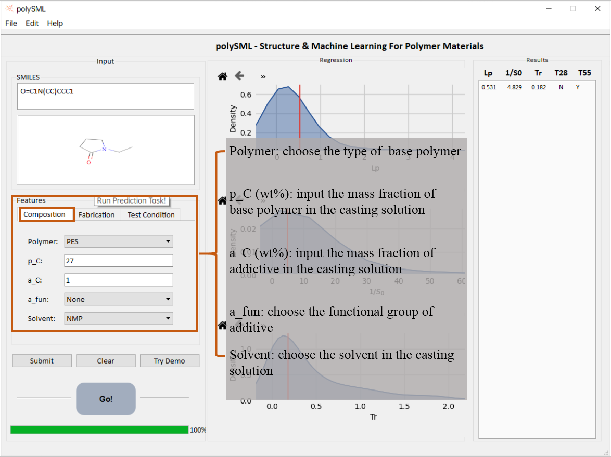
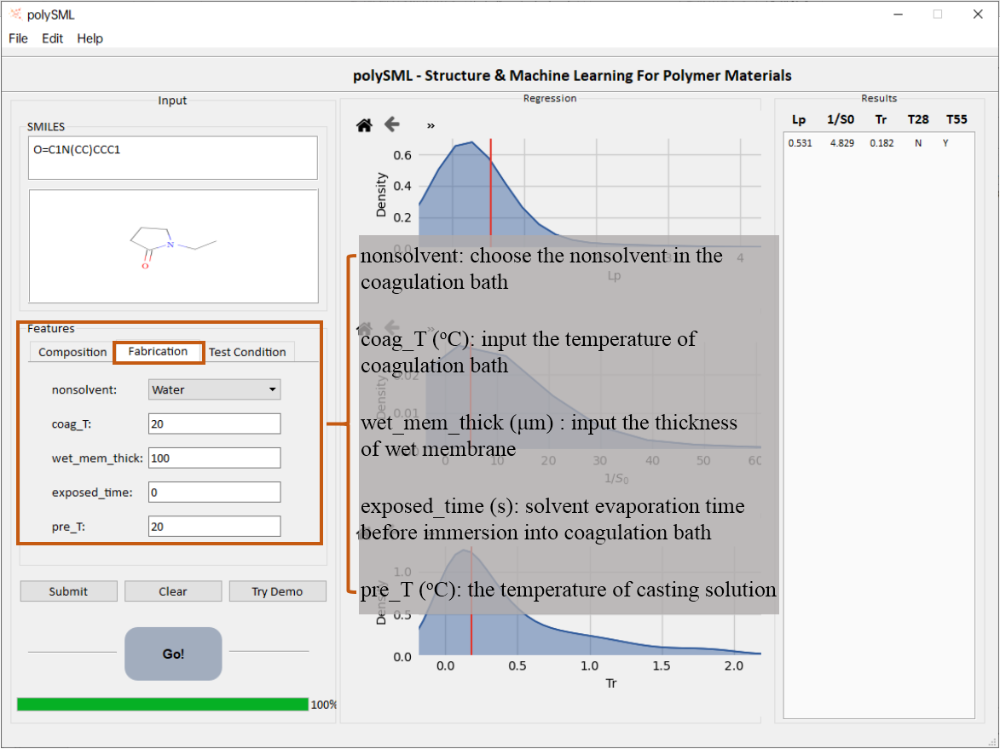
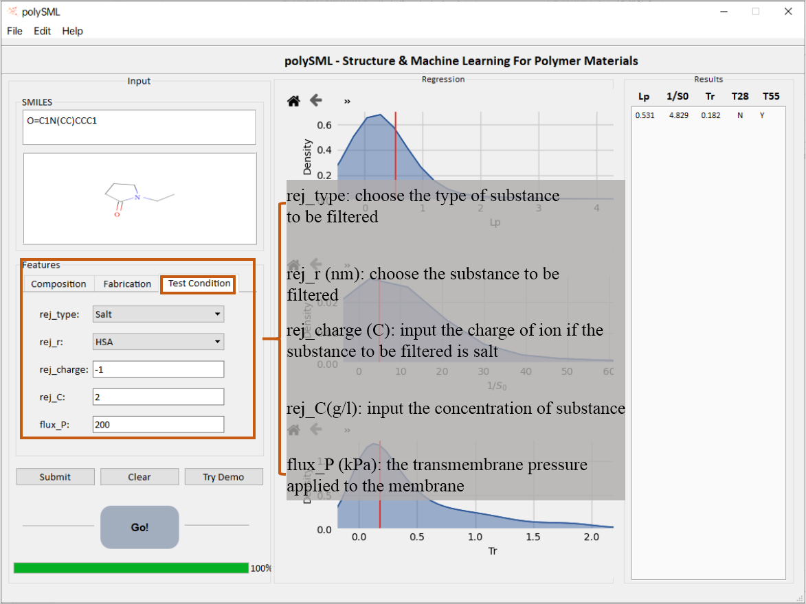
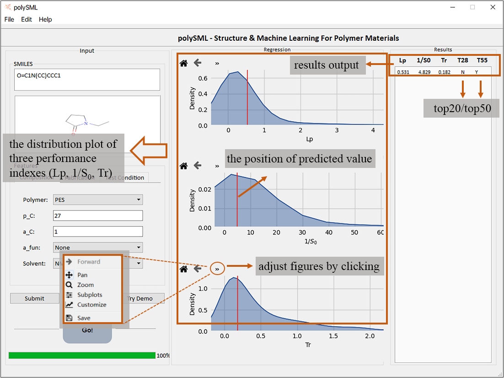
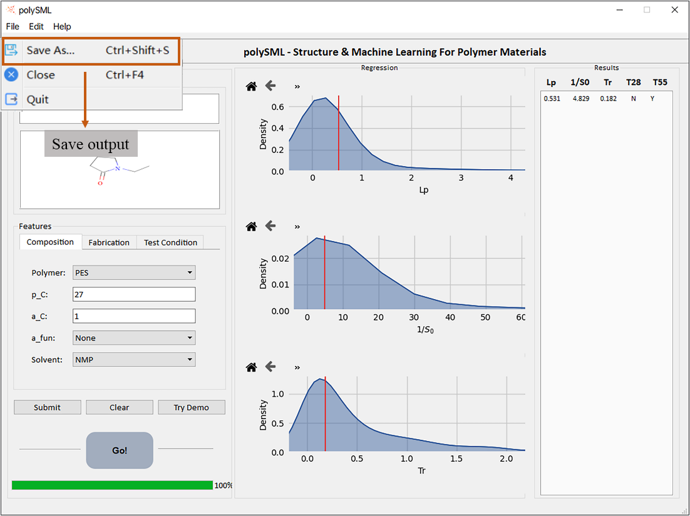

# polySML: structure & machine learning for polymer materials

This suite of standalone software is to predict mechanical, thermal, conductivity, filtration and separational etc. properties for variant polymer materials.

## 1 Requirements

Win7/vista/win8/win10, 105M RAM, 400M storage

## 2 Usage

This model provides the prediction for three critical performance indexes accounting micro-/ultra-/nano-filtration membranes and the evaluation of the overall membrane performance grade.

1. Input correct **SMILES**  for addictive in polymer solution (SMILES can be queried from Pubchem https://pubchem.ncbi.nlm.nih.gov/ ).
2. Parameters for **composition, fabrication** and **test condition**.

   

   

   

3. Click **Submit** and check all the inputs correct.

4. Click **GO** for predictions.

   

5. Click **Save As** to save outputs.

   

   

## 3 Predictor: WFM_poly

This model provides the prediction for three critical performance indexes accounting micro-/ultra-/nano-filtration membranes and the evaluation of the overall membrane performance grade.

### 3.1 Regression models

#### Permeability(Lp)

The permeability of membrane is defined as:
$$
Lp=J_v/(ΔP×p_0 )
$$

Where J~v~ is the volumetric filtrate flux (m/s), ΔP is the transmembrane pressure (Pa), p~0~ is the unit permeability coefficient (1 m·s^-1^ Pa^-1^)

#### Selectivity(1/S~0~)

The selectivity of membrane is defined as:
$$
1/S_0=1/(1-R)=C_f/C_p
$$

Where R is the rejection ratio (%), C~p~ and C~f~ are the concentrations of substances in the permeation and feed flux (wt%).

#### Trade-off coefficient(Tr)

The trade-off coefficient of membrane is defined as:
$$
T_r=(2×Lp×1/S_0)/(Lp+1/S_0 )
$$

### 3.2 Classification models

According to the "trade-off curve", we got four curves which can divide the macromolecules and salts data points into 50:50 and 20:80. The output result is "Y" means that the performance of the membrane is above the trade-off curve, on the contrary, the result is "N".

#### **Features**

Features used for  prediction models are listed below:

| **ID** | **Feature**   | **Unit** | **Description**                                              |
| ------ | ------------- | -------- | ------------------------------------------------------------ |
| **1**  | p_C           | wt%      | The  weight fraction of base polymer in casting solution     |
| **2**  | a_C           | wt%      | The  weight fraction of the addictive in casting solution    |
| **3**  | s_C           | wt%      | The  weight fraction of the solvent in casting solution      |
| **4**  | s_Disp        | -        | Hansen solubility  parameter (Dispersion force for solvent)  |
| **5**  | p_Disp        |          | Hansen solubility parameter (Dispersion force for monomer in polymer) |
| **6**  | RED_S         |          | The relative energy difference between base polymer and solvent |
| **7**  | RED_NS        |          | The relative energy difference between base polymer and non-solvent |
| **8**  | Bp            | ^oC     | Boiling point for solvent and non-solvent                    |
| **9**  | Vp            | mmHg     | The saturated vapor pressure at 25oC for solvent and non-solvent |
| **10** | HDT           | ^o^C     | Heat Deflection Temperature with loading of 1.8MPa           |
| **11** | coag_T        | ^o^C     | The temperature of coagulation bath                          |
| **12** | pre_T         | ^o^C     | The temperature during membrane formation                    |
| **13** | exposed.time  | s        | The exposed time before immersing the casting solution into the non-solvent |
| **14** | wet_mem_thick | μm       | The thickness of solution on the substrate controlled by the scraper |
| **15** | flux_P        | kPa      | Transmembrane pressure in performance measurement            |
| **16** | rej_C         | wt%      | The  concentration of substance (protein, salt etc,) in feeding flux |
| **17** | rej_type      |          | The  type of separation substance                            |
| **18** | rej_charge    | C        | The charge of separation substance                           |
| **19** | rej_r         | nm       | The radius of  rejection substance                           |
| **20** | porosity      | %        | Volume fraction of water accessible voids in membrane        |
| **21** | CA            | ^o^      | Water static contact angle on membrane  surface              |

## 4 License

The copyright for this software suite is owe to the authors, academic free for current version and commercial usages please contact the corresponding author yunqi@ciac.ac.cn.

## 5 References

User are encouraged to cite the following references for special predictors.

1. Liu T, Liu L, Cui F, Ding F, & Li Y Predict the performance of polyvinylidene fluoride, polyethersulfone and polysulfone micro/ultra/nano-filtration membranes, 2020, submitted.

2. Liu L, Chen W, Liu T, Kong X, Zheng J, & Li Y Rational design of hydrocarbon-based sulfonated copolymers for proton exchange membranes J. Mater. Chem. A, 2019 7:11847-11857.

3. Liu L, Chen W, & Li Y A Statistical Study of Proton Conduction in Nafion?-based Composite Membranes: Prediction, Filler Selection and Fabrication Methods J. Membr. Sci., 2018 549:393-402.

4. Liu L, Chen W, & Li Y An overview of the proton conductivity of nafion membranes through a statistical analysis J. Membr. Sci., 2016 504:1-9.

   **Release log:**
   201912 version v0, construct the UI and common block. WFM_poly model was integrated.
   202003 version v1£¬predictor about polymer materials for water filtration membranes(WFM_poly) was integrated.

## 6 Limitation

Current models mainly focus on the types of polymers, additions, solvents reported. For novel compounds, chemical structures, predictions are made based on knowledge, confidence needs validation in blind-test. We are not guarantee the prediction is fully accurate but guidelines are possible.

## 7 Bug report and suggestions

Please contact either lyliu@ciac.ac.cn or yunqi@ciac.ac.cn for bugs or suggestions.

## 8 About us

We are a research group didicate in structure and machine learning study on polymer materials. We are welcoming suggestions and collaborations. Contact Prof. Yunqi Li for further information.

